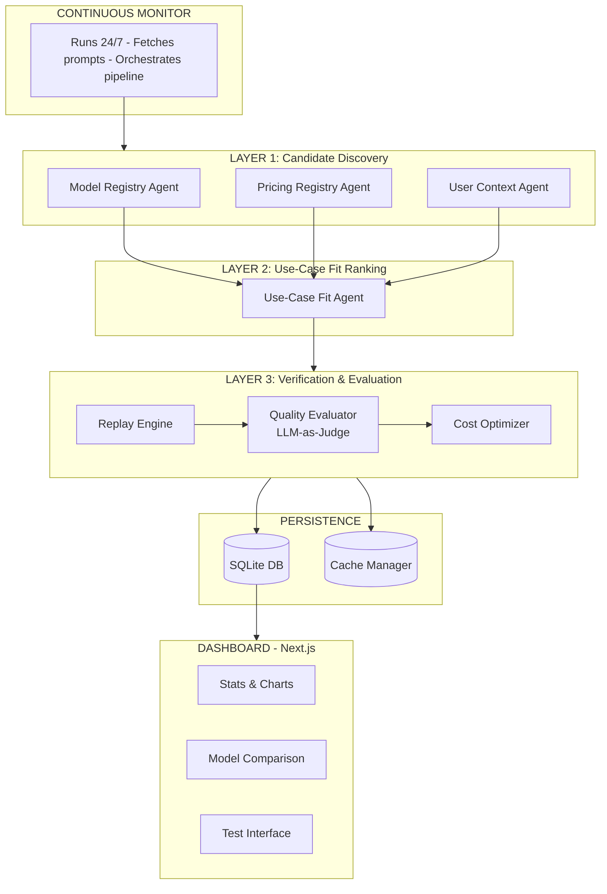
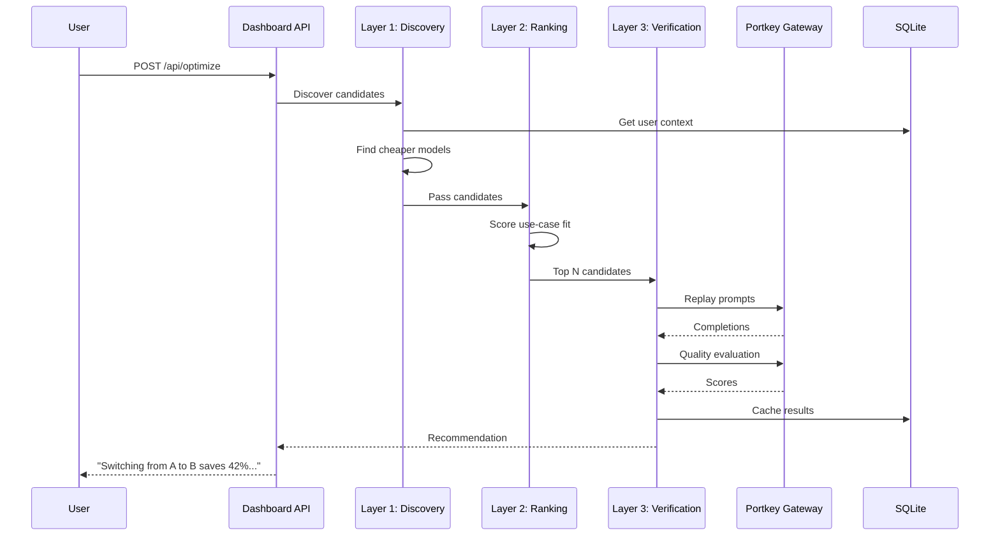

# Cost-Quality Optimization System

## Track 4: Historical Replay & Trade-off Analysis

**Portkey AI Builders Challenge - Production-Ready AI System**

[](/)
[](/)
[](/)

---

## What It Does

A **production-grade optimization system** that delivers:

> **"Switching from GPT-4o-mini to GPT-3.5-turbo reduces cost by 45.8% with 7.0% quality impact."**

### Key Capabilities

| Feature | Description |
|---------|-------------|
| **Historical Replay** | Replay prompts across 4+ LLM providers |
| **LLM-as-Judge** | AI evaluates quality on 4 dimensions |
| **Cost Analysis** | Real-time cost tracking per model |
| **Refusal Detection** | Track model safety refusals |
| **Continuous Mode** | 24/7 monitoring & optimization |
| **Observability** | Prometheus metrics, structured logging |

---

## Architecture



### Data Flow



---

## Hackathon Requirements Checklist

| Requirement | Status | Implementation |
|-------------|--------|----------------|
| **Continuous System** | Done | `continuous_monitor.py` - runs 24/7 |
| **LLM Usage** | Done | LLM-as-judge for quality evaluation |
| **State Management** | Done | SQLite DB + JSON state files |
| **Cost Trade-offs** | Done | Per-prompt cost analysis |
| **Quality Trade-offs** | Done | 4-dimension quality scoring |
| **Refusal Rates** | Done | Auto-detection of model refusals |
| **Failure Handling** | Done | Retry logic, error tracking |
| **Explainability** | Done | Reasoning for each recommendation |
| **Observability** | Done | Prometheus metrics, structured logs |
| **Historical Replay** | Done | Replay across 4 models |

---

## Quick Start

### 1. Setup
```bash
cd portkey_ai_hackathon
.\venv\Scripts\Activate.ps1
pip install -r requirements.txt
```

### 2. Set API Key
```bash
$env:PORTKEY_API_KEY="your_key_here"
```

### 3. Run

**Option A: Full System**
```powershell
.\start.ps1
# Choose option 3 for both backend + frontend
```

**Option B: Manual**
```bash
# Terminal 1: Backend
cd backend
python dashboard_api.py

# Terminal 2: Frontend  
cd dashboard
npm run dev
```

### 4. Access
- **Dashboard**: http://localhost:3000
- **Test Prompts**: http://localhost:3000/test
- **Health Check**: http://localhost:5000/health
- **Metrics**: http://localhost:5000/metrics

---

## API Endpoints

| Endpoint | Method | Description |
|----------|--------|-------------|
| `/api/dashboard-data` | GET | Dashboard stats & data |
| `/api/optimize` | POST | Run multi-agent optimization |
| `/analyze` | POST | Analyze a prompt |
| `/health` | GET | System health check |
| `/metrics` | GET | Prometheus metrics |
| `/api/system-stats` | GET | Detailed system stats |

### Example: Run Optimization
```bash
curl -X POST http://localhost:5000/api/optimize \
  -H "Content-Type: application/json" \
  -d '{"user_id": "default"}'
```

Response:
```json
{
  "status": "success",
  "summary": "Switching from gpt-4o to GPT-4o Mini reduces cost by 96.5% with a 2.0% quality impact.",
  "recommendation": {
    "current_model": "gpt-4o",
    "recommended_model": "gpt-4o-mini",
    "projected_cost_saving_percent": 96.5,
    "projected_quality_impact_percent": -2.0,
    "business_impact": {
      "monthly_savings_usd": 53.05,
      "annual_savings_usd": 636.60
    }
  }
}
```

### Example: Analyze Prompt
```bash
curl -X POST http://localhost:5000/analyze \
  -H "Content-Type: application/json" \
  -d '{"prompt": "Write a Python function to sort a list"}'
```

---

## Models Tested

| Model | Provider | Strengths | Cost/1K |
|-------|----------|-----------|---------|
| GPT-4-turbo | OpenAI | Complex tasks | $10.00 |
| GPT-4o | OpenAI | Balanced | $2.50 |
| GPT-4o-mini | OpenAI | Cost-effective | $0.15 |
| GPT-3.5-turbo | OpenAI | Fast, Budget | $0.50 |

---

## Project Structure

```
portkey_ai_hackathon/
├── backend/                 # Python API & optimization engine
│   ├── dashboard_api.py     # Flask API server
│   ├── orchestrator.py      # Multi-agent optimization system
│   ├── model_registry.py    # Model catalog with pricing
│   ├── user_metadata.py     # User profiles & constraints
│   ├── cache_manager.py     # State & caching
│   ├── replay_engine.py     # Multi-model replay
│   ├── quality_evaluator.py # LLM-as-judge
│   ├── optimizer.py         # Cost-quality analysis
│   ├── database.py          # SQLite persistence
│   ├── observability.py     # Metrics & logging
│   └── data/                # SQLite DB + logs
├── dashboard/               # Next.js frontend
│   ├── app/                 # Pages & routes
│   └── components/          # UI components
├── start.ps1               # Quick start script
└── README.md               # This file
```

---

## Production Readiness

### If this ran unattended for 6 months:

1. **State Persistence** - SQLite DB survives restarts
2. **Failure Recovery** - Auto-retry with exponential backoff
3. **Observability** - Prometheus metrics for alerting
4. **Health Checks** - `/health` endpoint for load balancers
5. **Structured Logging** - JSON logs for analysis
6. **Refusal Tracking** - Detect model safety issues

### Would an enterprise trust it?
Yes - with proper monitoring, alerting, and the observability built in.

---

## Sample Output

```
============================================================
OPTIMIZATION RECOMMENDATION
============================================================
Current Model: GPT-4o
Recommended Model: GPT-4o-mini

Cost Reduction: 96.5%
Quality Impact: 2.0% decrease

Confidence: 88%
Sample Size: 5 prompts

Reasoning: GPT-4o-mini achieves near-equivalent quality at 
significantly lower cost for general tasks.
============================================================
```

---

## Team

Built for the Portkey AI Builders Challenge

---

## License

MIT
