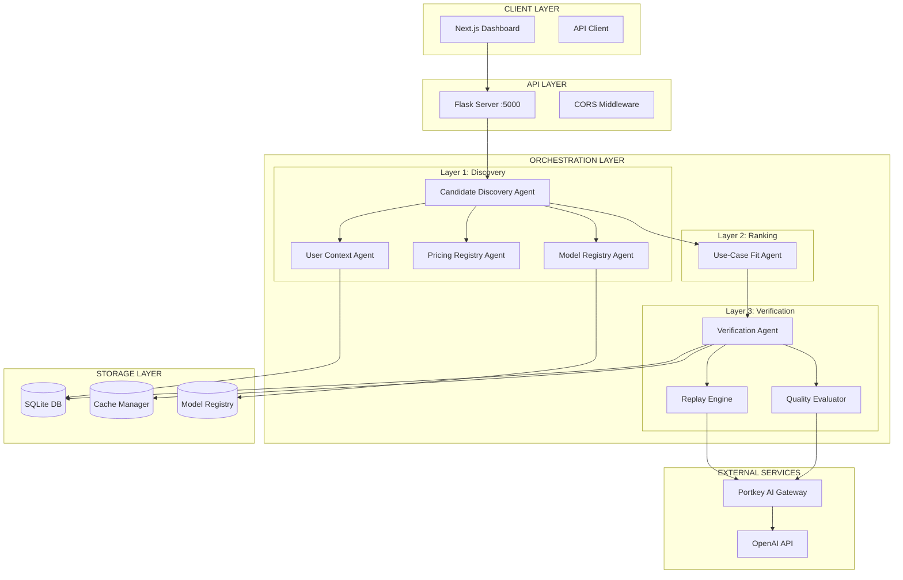
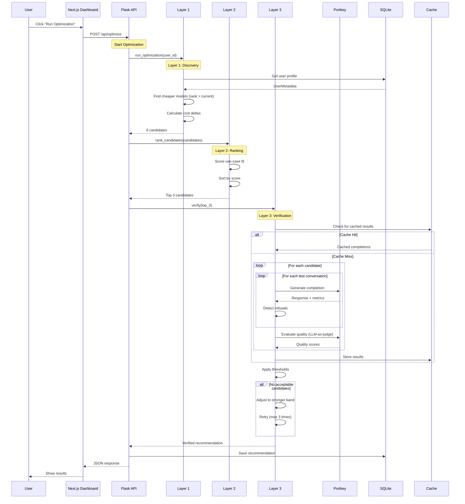

# Cost-Quality Optimization System - Complete Technical Documentation

## Track 4: Historical Replay and Trade-off Analysis

**Portkey AI Builders Hackathon**

---

## Table of Contents

1. [Problem Statement](#1-problem-statement)
2. [Solution Overview](#2-solution-overview)
3. [Architecture Deep Dive](#3-architecture-deep-dive)
4. [Component Documentation](#4-component-documentation)
5. [Data Flow](#5-data-flow)
6. [API Reference](#6-api-reference)
7. [Database Schema](#7-database-schema)
8. [Configuration](#8-configuration)
9. [Setup and Installation](#9-setup-and-installation)
10. [Usage Guide](#10-usage-guide)
11. [Testing](#11-testing)
12. [Production Considerations](#12-production-considerations)

---

## 1. Problem Statement

### The Challenge

Organizations using LLMs face a critical problem: **model choices are often made blindly**. Teams typically:

- Pick a model based on marketing or reputation
- Stick with it without measuring actual performance
- Overpay for capabilities they don't need
- Have no visibility into cost vs quality trade-offs

### Track 4 Requirements

Build a system that:

1. **Replays historical prompt-completion data** across multiple models
2. **Evaluates across models and guardrails** using consistent metrics
3. **Measures cost, quality, and refusal rates** for each model
4. **Recommends better trade-offs** with business-readable output

### Expected Output Format

```
"Switching from Model A to Model B reduces cost by 42% with a 6% quality impact."
```

---

## 2. Solution Overview

### What We Built

A **production-grade, multi-agent optimization system** that:

1. Takes a user's current model and usage patterns
2. Discovers cheaper alternative models from a registry
3. Ranks candidates based on use-case fit
4. Verifies quality through actual LLM calls (replay)
5. Evaluates quality using LLM-as-judge
6. Produces business-readable recommendations

### Key Innovation: 3-Layer Multi-Agent Architecture

Instead of a simple comparison script, we built a sophisticated orchestration system:

```
Layer 1: Candidate Discovery    - Find cheaper alternatives
Layer 2: Use-Case Fit Ranking   - Score based on user needs
Layer 3: Verification           - Actually test with LLM calls
```

### Technology Stack

| Component | Technology | Purpose |
|-----------|------------|---------|
| Backend | Python 3.12, Flask | API server and orchestration |
| Frontend | Next.js 14, React | Dashboard UI |
| LLM Gateway | Portkey AI | Unified API for multiple models |
| Database | SQLite | Persistence and caching |
| Metrics | Prometheus format | Observability |

---

## 3. Architecture Deep Dive

### System Architecture



### Why Multi-Agent?

Traditional approaches run a simple loop: test each model, compare scores. Our multi-agent approach provides:

1. **Separation of Concerns** - Each agent has one job
2. **Cacheability** - Results can be cached at each layer
3. **Extensibility** - Easy to add new agents (drift detection, etc.)
4. **Retry Logic** - If Layer 3 fails quality, we can retry with different candidates
5. **Cost Control** - Budget limits at each layer

### The 3-Layer Pipeline

#### Layer 1: Candidate Discovery

**Purpose**: Find models that are cheaper than the user's current model

**Agents Involved**:
- `ModelRegistryAgent` - Retrieves model metadata from registry
- `PricingRegistryAgent` - Gets pricing information
- `UserContextAgent` - Loads user profile and constraints
- `CandidateDiscoveryAgent` - Orchestrates discovery, filters by rank

**Logic**:
```python
# Simplified discovery logic
current_model = user.current_model
current_rank = registry.get_model(current_model).rank

# Find models with higher rank (cheaper)
candidates = [m for m in all_models if m.rank > current_rank]

# Calculate cost delta for each
for candidate in candidates:
    candidate.cost_delta = calculate_savings(current_model, candidate)
```

**Output**: List of 6 candidate models with pricing data

#### Layer 2: Use-Case Fit Ranking

**Purpose**: Score candidates based on how well they fit the user's use case

**Agent**: `UseCaseFitAgent`

**Scoring Algorithm** (100 points total):
```python
def calculate_fit_score(candidate, use_case, constraints):
    score = 0
    
    # Strength matching (0-40 points)
    # Does the model excel at what the user needs?
    required_strengths = USE_CASE_STRENGTHS[use_case]
    model_strengths = candidate.capabilities.strengths
    matches = count_matches(required_strengths, model_strengths)
    score += (matches / len(required_strengths)) * 40
    
    # Latency fit (0-20 points)
    # Can it meet the user's latency requirements?
    if candidate.latency_tier == "fast":
        score += 20
    elif candidate.latency_tier == "medium" and constraints.max_latency >= 3000:
        score += 15
    
    # Reliability (0-20 points)
    if candidate.reliability_tier == "high":
        score += 20
    
    # Cost efficiency bonus (0-20 points)
    # More savings = more points
    score += min(20, candidate.cost_delta.percent_saving / 5)
    
    return score
```

**Output**: Top 3 candidates with fit scores and rationale

#### Layer 3: Verification and Evaluation

**Purpose**: Actually test the candidates with real LLM calls

**Agents**:
- `VerificationAgent` - Orchestrates the testing
- `ReplayEngine` - Makes LLM calls via Portkey
- `QualityEvaluator` - LLM-as-judge evaluation

**Process**:

1. **Get Test Conversations**
   - Use user's historical conversations if available
   - Fall back to synthetic tests for cold start

2. **Replay on Each Candidate**
   ```python
   for candidate in top_candidates:
       for conversation in test_conversations:
           # Call LLM via Portkey
           completion = replay_engine.replay(conversation, candidate)
           
           # Track metrics
           results.cost += completion.cost
           results.latency += completion.latency_ms
           if completion.is_refusal:
               results.refusals += 1
   ```

3. **Quality Evaluation (LLM-as-Judge)**
   ```python
   for completion in completions:
       # Use GPT-4o-mini to judge quality
       score = quality_evaluator.evaluate(
           original_prompt=conversation,
           model_response=completion.response
       )
       # Returns score on 4 dimensions:
       # - Accuracy (0-100)
       # - Helpfulness (0-100)
       # - Clarity (0-100)
       # - Completeness (0-100)
   ```

4. **Apply Thresholds**
   ```python
   # Decision thresholds
   MIN_COST_SAVING = 20%      # Must save at least 20%
   MAX_QUALITY_DROP = 5%      # Can't lose more than 5% quality
   MIN_CONFIDENCE = 0.3       # Need enough samples
   
   acceptable = [c for c in evaluated if
       c.cost_saving >= MIN_COST_SAVING and
       c.quality_drop <= MAX_QUALITY_DROP and
       c.confidence >= MIN_CONFIDENCE
   ]
   ```

5. **Retry Loop**
   If no candidates meet thresholds, retry with stronger (more expensive) models:
   ```python
   for iteration in range(MAX_ITERATIONS):
       result = verify(candidates)
       if result.acceptable_candidates:
           return result
       # Adjust to stronger band
       candidates = get_stronger_candidates(iteration)
   ```

**Output**: Verified recommendation with quality scores

---

## 4. Component Documentation

### 4.1 Model Registry (`model_registry.py`)

**Purpose**: Centralized catalog of all available models with metadata

**Key Classes**:

```python
@dataclass
class ModelCapabilities:
    context_window: int          # e.g., 128000
    supports_json_mode: bool     # Structured output support
    supports_function_calling: bool
    supports_vision: bool
    strengths: List[str]         # e.g., ["coding", "reasoning"]
    latency_tier: str            # "fast", "medium", "slow"
    reliability_tier: str        # "high", "medium", "low"

@dataclass
class ModelPricing:
    input_price_per_1k: float    # $ per 1000 input tokens
    output_price_per_1k: float   # $ per 1000 output tokens
    rate_limit_rpm: int          # Requests per minute

@dataclass
class ModelEntry:
    model_id: str                # e.g., "gpt-4o-mini"
    display_name: str            # e.g., "GPT-4o Mini"
    provider: str                # e.g., "openai"
    portkey_slug: str            # e.g., "@openai/gpt-4o-mini"
    rank: int                    # 1=most expensive, higher=cheaper
    capabilities: ModelCapabilities
    pricing: ModelPricing
    version: str                 # For cache invalidation
    is_active: bool
```

**Registered Models**:

| Model | Rank | Input $/1K | Output $/1K | Strengths |
|-------|------|------------|-------------|-----------|
| gpt-4-turbo | 1 | $10.00 | $30.00 | Complex tasks |
| gpt-4o | 2 | $2.50 | $10.00 | Balanced |
| gpt-4o-mini | 3 | $0.15 | $0.60 | Cost-effective |
| gpt-3.5-turbo | 4 | $0.50 | $1.50 | Fast, budget |

**Key Methods**:

```python
class ModelRegistryService:
    def get_model(model_id: str) -> ModelEntry
    def get_all_models() -> List[ModelEntry]
    def get_cheaper_models(current_model: str) -> List[ModelEntry]
    def calculate_cost_delta(from_model, to_model, input_tokens, output_tokens) -> Dict
    def register_conflict(model_id, conflict_type, details)
    def get_unresolved_conflicts() -> List[ModelConflict]
```

### 4.2 User Metadata (`user_metadata.py`)

**Purpose**: Store user profiles, constraints, and conversation history

**Key Classes**:

```python
@dataclass
class UserConstraints:
    max_cost_per_request: float = 0.10      # Max $ per request
    max_latency_ms: int = 5000              # Max acceptable latency
    min_quality_score: float = 70.0         # Minimum quality threshold
    required_capabilities: List[str] = []    # Must-have features
    blocked_providers: List[str] = []        # Providers to avoid

@dataclass
class UserMetadata:
    user_id: str
    current_model: str                       # What they're using now
    use_case: str                            # "coding", "general", etc.
    constraints: UserConstraints
    avg_input_tokens: int = 500              # Typical request size
    avg_output_tokens: int = 200
    monthly_request_volume: int = 10000
    last_n_conversations: List[Dict] = []    # For verification
```

**Database Tables**:

```sql
CREATE TABLE users (
    user_id TEXT PRIMARY KEY,
    current_model TEXT,
    use_case TEXT,
    constraints_json TEXT,
    avg_input_tokens INTEGER,
    avg_output_tokens INTEGER,
    monthly_request_volume INTEGER,
    created_at TEXT,
    updated_at TEXT
);

CREATE TABLE conversations (
    id INTEGER PRIMARY KEY,
    user_id TEXT,
    conversation_hash TEXT UNIQUE,
    messages_json TEXT,
    created_at TEXT
);
```

### 4.3 Cache Manager (`cache_manager.py`)

**Purpose**: Cache verification results to avoid redundant LLM calls

**Features**:
- TTL-based expiration (default 1 hour)
- Version-based invalidation
- Source tracking (which registry version was used)

**Key Classes**:

```python
class CacheKeys:
    MODEL_OUTPUT = "model_output"
    EVALUATION = "evaluation"
    RECOMMENDATION = "recommendation"

class CacheManager:
    def generate_key(prefix, **kwargs) -> str
    def get(key) -> Optional[Any]
    def set(key, value, ttl_seconds=3600) -> bool
    def invalidate(key) -> bool
    def invalidate_by_prefix(prefix) -> int
    def invalidate_on_version_change(component, new_version) -> int
```

**Cache Invalidation Rules**:

| Event | Action |
|-------|--------|
| Model registry update | Invalidate all `model_output` entries |
| Pricing update | Invalidate all recommendations |
| Rubric update | Invalidate all evaluations |
| User constraint change | Invalidate user's recommendations |

### 4.4 Replay Engine (`replay_engine.py`)

**Purpose**: Make LLM calls via Portkey AI Gateway

**Key Features**:
- Unified API for multiple providers
- Automatic retry with exponential backoff
- Refusal detection
- Cost and latency tracking

**Configuration**:

```python
# Portkey client setup
client = Portkey(
    api_key=os.getenv("PORTKEY_API_KEY"),
    base_url="https://api.portkey.ai/v1"
)
```

**Key Methods**:

```python
class ReplayEngine:
    def replay_prompt_on_model(prompt: PromptData, model_config: Dict) -> CompletionResult:
        """
        Replay a single prompt on a specific model.
        
        Returns:
            CompletionResult with:
            - response: str
            - tokens_input: int
            - tokens_output: int
            - latency_ms: float
            - cost: float
            - success: bool
            - is_refusal: bool
            - error: Optional[str]
        """
    
    def replay_prompt_across_models(prompt: PromptData) -> List[CompletionResult]:
        """Test a prompt on all configured models."""
```

**Refusal Detection**:

```python
REFUSAL_INDICATORS = [
    "I cannot", "I can't", "I'm unable",
    "I apologize", "against my guidelines",
    "I'm not able", "not appropriate"
]

def detect_refusal(response: str) -> bool:
    response_lower = response.lower()
    return any(indicator in response_lower for indicator in REFUSAL_INDICATORS)
```

### 4.5 Quality Evaluator (`quality_evaluator.py`)

**Purpose**: Use LLM-as-judge to score response quality

**Evaluation Dimensions**:

| Dimension | Description | Weight |
|-----------|-------------|--------|
| Accuracy | Factually correct, no hallucinations | 25% |
| Helpfulness | Addresses the user's actual need | 25% |
| Clarity | Well-structured, easy to understand | 25% |
| Completeness | Covers all aspects of the request | 25% |

**Evaluation Prompt**:

```python
EVALUATION_PROMPT = """
You are an expert evaluator. Rate this response on a scale of 0-100.

Original Request: {prompt}

Model Response: {response}

Evaluate on these dimensions:
1. Accuracy (0-100): Is the information factually correct?
2. Helpfulness (0-100): Does it address the user's need?
3. Clarity (0-100): Is it well-organized and clear?
4. Completeness (0-100): Does it cover all aspects?

Respond in JSON format:
{
    "accuracy": <score>,
    "helpfulness": <score>,
    "clarity": <score>,
    "completeness": <score>,
    "overall": <average>,
    "reasoning": "<brief explanation>"
}
"""
```

**Output**:

```python
@dataclass
class QualityScore:
    overall_score: float              # 0-100
    dimension_scores: Dict[str, int]  # accuracy, helpfulness, etc.
    reasoning: str                    # Why this score
    confidence: float                 # 0-1
    evaluator_model: str              # Which model judged
```

### 4.6 Orchestrator (`orchestrator.py`)

**Purpose**: Coordinate all layers and produce final recommendation

**Decision Thresholds**:

```python
class Thresholds:
    MIN_COST_SAVING_PERCENT = 20.0      # Must save at least 20%
    MAX_QUALITY_DROP_PERCENT = 5.0       # Can't lose more than 5%
    MIN_CONFIDENCE_SCORE = 0.3           # Need enough test samples
    MAX_VERIFICATION_BUDGET_USD = 1.0    # Max $ for verification
    MAX_ITERATION_LOOPS = 3              # Retry attempts
    MIN_SAMPLE_SIZE = 5                  # Min conversations to test
```

**Main Entry Point**:

```python
class CostQualityOrchestrator:
    def run_optimization(user_id: str, k_candidates=6, n_top=3) -> Dict:
        """
        Run the complete 3-layer optimization pipeline.
        
        Args:
            user_id: User to optimize for
            k_candidates: How many candidates to discover (Layer 1)
            n_top: How many to verify (Layer 2 -> Layer 3)
        
        Returns:
            {
                "status": "success",
                "summary": "Switching from X to Y saves 42%...",
                "recommendation": { ... },
                "processing_time_seconds": 0.5,
                "verification_cost_usd": 0.01
            }
        """
```

### 4.7 Dashboard API (`dashboard_api.py`)

**Purpose**: Flask server exposing REST endpoints

**Endpoints**:

| Endpoint | Method | Description |
|----------|--------|-------------|
| `/health` | GET | System health check |
| `/metrics` | GET | Prometheus metrics |
| `/api/dashboard-data` | GET | Dashboard summary |
| `/api/optimize` | POST | Run optimization |
| `/api/user/<id>` | GET/POST | User profile |
| `/api/user/<id>/conversations` | POST | Add conversation |
| `/api/cache/stats` | GET | Cache statistics |
| `/api/cache/invalidate` | POST | Clear cache |
| `/analyze` | POST | Single prompt analysis |

### 4.8 Observability (`observability.py`)

**Purpose**: Metrics, logging, and health checks

**Metrics Collected**:

```python
class MetricsCollector:
    # Counters
    api_requests_total: int
    model_calls_total: Dict[str, int]
    model_errors_total: Dict[str, int]
    model_refusals_total: Dict[str, int]
    
    # Gauges
    total_cost_usd: float
    avg_quality_score: float
    avg_latency_ms: float
    
    # Histograms (for percentiles)
    latency_histogram: Dict[str, List[float]]
    quality_histogram: List[float]
```

**Prometheus Export**:

```
# HELP api_requests_total Total API requests
# TYPE api_requests_total counter
api_requests_total 150

# HELP model_calls_total Total calls per model
# TYPE model_calls_total counter
model_calls_total{model="gpt-4o-mini"} 45
model_calls_total{model="gpt-3.5-turbo"} 40

# HELP avg_latency_ms Average latency in milliseconds
# TYPE avg_latency_ms gauge
avg_latency_ms 850.5
```

**Health Check**:

```python
def get_system_health() -> Dict:
    return {
        "status": "healthy",  # or "degraded" or "unhealthy"
        "components": {
            "database": check_database(),
            "portkey": check_portkey_connection(),
            "cache": check_cache()
        },
        "uptime_seconds": get_uptime(),
        "last_successful_optimization": get_last_success_time()
    }
```

---

## 5. Data Flow

### Complete Request Flow



### Data Transformations

**Stage 1: Raw Models -> Candidates**
```
Input:  All 4 models from registry
Filter: rank > current_rank (cheaper)
Output: 2-3 cheaper candidates with cost_delta
```

**Stage 2: Candidates -> Ranked**
```
Input:  Candidates with cost data
Score:  Use-case fit (0-100)
Output: Top 3 sorted by score
```

**Stage 3: Ranked -> Verified**
```
Input:  Top 3 candidates
Test:   Run LLM calls, evaluate quality
Filter: Apply thresholds
Output: 0-3 acceptable candidates
```

**Stage 4: Verified -> Recommendation**
```
Input:  Acceptable candidates
Select: Best quality among acceptable
Format: Business-readable summary
```

---

## 6. API Reference

### POST /api/optimize

Run the multi-agent optimization pipeline.

**Request**:
```json
{
    "user_id": "default",
    "k_candidates": 6,
    "n_top": 3
}
```

**Response (Success)**:
```json
{
    "status": "success",
    "timestamp": "2026-01-17T15:43:53.815818+00:00",
    "processing_time_seconds": 0.073,
    "iterations_required": 0,
    "recommendation": {
        "current_model": "gpt-4o",
        "recommended_model": "gpt-4o-mini",
        "recommended_model_display": "GPT-4o Mini",
        "projected_cost_saving_percent": 96.5,
        "projected_quality_impact_percent": -2.0,
        "confidence": 0.3,
        "evaluation_summary": {
            "quality_score": 88.0,
            "format_failure_rate": 0.0,
            "refusal_rate": 0.0,
            "samples_evaluated": 3,
            "evaluation_stage": "completed"
        },
        "business_impact": {
            "monthly_request_volume": 10000,
            "current_monthly_cost_usd": 55.0,
            "projected_monthly_cost_usd": 1.95,
            "projected_monthly_savings_usd": 53.05,
            "annual_savings_usd": 636.6
        },
        "reasons": [
            "Cost reduction of 96.5%",
            "Quality impact of -2.0%",
            "Strong fit for general use case"
        ],
        "fallback_option": {
            "model": "gpt-3.5-turbo",
            "cost_saving_percent": 90.0,
            "quality_impact_percent": -2.0
        }
    },
    "thresholds_used": {
        "min_cost_saving_percent": 20.0,
        "max_quality_drop_percent": 5.0,
        "min_confidence": 0.3
    },
    "verification_cost_usd": 0.006,
    "summary": "Switching from gpt-4o to GPT-4o Mini reduces cost by 96.5% with a 2.0% quality impact."
}
```

**Response (No Recommendation)**:
```json
{
    "status": "no_recommendation",
    "reason": "No model meets the quality and cost thresholds",
    "current_model": "gpt-4o-mini",
    "suggestion": "Current model appears to be optimal for your use case"
}
```

### POST /analyze

Analyze a single prompt across all models.

**Request**:
```json
{
    "prompt": "Write a Python function to sort a list"
}
```

**Response**:
```json
{
    "use_case": "Code Generation",
    "recommended_model": "GPT-4o-mini",
    "reasoning": "GPT-4o-mini recommended for code generation with 92.0/100 quality score",
    "cost_savings_percent": 45.8,
    "quality_impact_percent": 7.0,
    "models": [
        {
            "model_name": "GPT-4o-mini",
            "quality_score": 92.0,
            "cost": 0.000152,
            "latency_ms": 850,
            "response": "def sort_list(lst):\n    return sorted(lst)",
            "success": true
        }
    ]
}
```

### GET /api/user/{user_id}

Get user profile.

**Response**:
```json
{
    "user_id": "default",
    "current_model": "gpt-4o",
    "use_case": "general",
    "constraints": {
        "max_cost_per_request": 0.10,
        "max_latency_ms": 5000,
        "min_quality_score": 70.0
    },
    "avg_input_tokens": 500,
    "avg_output_tokens": 200,
    "monthly_request_volume": 10000
}
```

### POST /api/user/{user_id}

Update user profile.

**Request**:
```json
{
    "current_model": "gpt-4-turbo",
    "use_case": "coding",
    "constraints": {
        "max_latency_ms": 3000,
        "min_quality_score": 85.0
    }
}
```

### GET /health

Health check endpoint.

**Response**:
```json
{
    "status": "healthy",
    "uptime_seconds": 3600,
    "components": {
        "database": "ok",
        "cache": "ok"
    }
}
```

---

## 7. Database Schema

### SQLite Tables

```sql
-- User profiles
CREATE TABLE users (
    user_id TEXT PRIMARY KEY,
    current_model TEXT NOT NULL,
    use_case TEXT DEFAULT 'general',
    constraints_json TEXT,
    avg_input_tokens INTEGER DEFAULT 500,
    avg_output_tokens INTEGER DEFAULT 200,
    monthly_request_volume INTEGER DEFAULT 10000,
    created_at TEXT NOT NULL,
    updated_at TEXT NOT NULL
);

-- User conversation history
CREATE TABLE conversations (
    id INTEGER PRIMARY KEY AUTOINCREMENT,
    user_id TEXT NOT NULL,
    conversation_hash TEXT UNIQUE,
    messages_json TEXT NOT NULL,
    created_at TEXT NOT NULL,
    FOREIGN KEY (user_id) REFERENCES users(user_id)
);

-- Prompts analyzed
CREATE TABLE prompts (
    prompt_id TEXT PRIMARY KEY,
    content TEXT NOT NULL,
    use_case TEXT,
    created_at TEXT NOT NULL
);

-- Model completions
CREATE TABLE completions (
    id INTEGER PRIMARY KEY AUTOINCREMENT,
    prompt_id TEXT NOT NULL,
    model_name TEXT NOT NULL,
    completion_json TEXT NOT NULL,
    created_at TEXT NOT NULL,
    FOREIGN KEY (prompt_id) REFERENCES prompts(prompt_id)
);

-- Quality evaluations
CREATE TABLE quality_evaluations (
    id INTEGER PRIMARY KEY AUTOINCREMENT,
    prompt_id TEXT NOT NULL,
    model_name TEXT NOT NULL,
    evaluation_json TEXT NOT NULL,
    created_at TEXT NOT NULL,
    FOREIGN KEY (prompt_id) REFERENCES prompts(prompt_id)
);

-- Optimization recommendations
CREATE TABLE recommendations (
    id INTEGER PRIMARY KEY AUTOINCREMENT,
    current_model TEXT NOT NULL,
    recommended_model TEXT NOT NULL,
    cost_reduction_percent REAL,
    quality_impact_percent REAL,
    avg_quality_loss REAL,
    cost_quality_ratio REAL,
    use_case TEXT,
    created_at TEXT NOT NULL
);

-- Cache entries
CREATE TABLE cache (
    cache_key TEXT PRIMARY KEY,
    value_json TEXT NOT NULL,
    created_at TEXT NOT NULL,
    expires_at TEXT NOT NULL,
    version TEXT NOT NULL,
    source_versions_json TEXT,
    hit_count INTEGER DEFAULT 0
);

-- Model conflicts (for tracking issues)
CREATE TABLE model_conflicts (
    id INTEGER PRIMARY KEY AUTOINCREMENT,
    model_id TEXT NOT NULL,
    conflict_type TEXT NOT NULL,
    details_json TEXT,
    resolved INTEGER DEFAULT 0,
    created_at TEXT NOT NULL
);
```

---

## 8. Configuration

### Environment Variables

```bash
# Required
PORTKEY_API_KEY=your_portkey_api_key

# Optional
FLASK_DEBUG=true
DATABASE_PATH=./data/optimization.db
LOG_LEVEL=INFO
```

### Model Configuration (`config.py`)

```python
MODELS_TO_TEST = [
    {
        "name": "GPT-4o-mini",
        "model": "@openai/gpt-4o-mini",
        "expected_cost_per_1k_input": 0.00015,
        "expected_cost_per_1k_output": 0.0006,
        "max_tokens": 1024
    },
    {
        "name": "GPT-3.5-turbo",
        "model": "@openai/gpt-3.5-turbo",
        "expected_cost_per_1k_input": 0.0005,
        "expected_cost_per_1k_output": 0.0015,
        "max_tokens": 1024
    },
    # ... more models
]

EVALUATION_CRITERIA = {
    "accuracy": "Is the information factually correct?",
    "helpfulness": "Does it address the user's need?",
    "clarity": "Is it well-organized and clear?",
    "completeness": "Does it cover all aspects?"
}
```

### Thresholds Configuration

```python
# In orchestrator.py
class Thresholds:
    MIN_COST_SAVING_PERCENT = 20.0      # Minimum savings to recommend
    MAX_QUALITY_DROP_PERCENT = 5.0       # Maximum acceptable quality loss
    MIN_CONFIDENCE_SCORE = 0.3           # Minimum confidence level
    MAX_VERIFICATION_BUDGET_USD = 1.0    # Budget for verification calls
    MAX_ITERATION_LOOPS = 3              # Retry attempts
    MIN_SAMPLE_SIZE = 5                  # Minimum test conversations
```

---

## 9. Setup and Installation

### Prerequisites

- Python 3.10 or higher
- Node.js 18 or higher
- Portkey AI account and API key

### Step-by-Step Installation

```bash
# 1. Clone the repository
git clone https://github.com/your-repo/portkey_ai_hackathon.git
cd portkey_ai_hackathon

# 2. Create Python virtual environment
python -m venv venv

# 3. Activate virtual environment
# Windows:
.\venv\Scripts\Activate.ps1
# Linux/Mac:
source venv/bin/activate

# 4. Install Python dependencies
pip install -r requirements.txt

# 5. Install dashboard dependencies
cd dashboard
npm install
cd ..

# 6. Set environment variable
# Windows:
$env:PORTKEY_API_KEY="your_key_here"
# Linux/Mac:
export PORTKEY_API_KEY="your_key_here"

# 7. Initialize database (automatic on first run)
# Database will be created at backend/data/optimization.db
```

### Running the System

**Option 1: Using start script (Windows)**
```powershell
.\start.ps1
# Choose option 3 for both backend + frontend
```

**Option 2: Manual startup**

Terminal 1 - Backend:
```bash
cd backend
python dashboard_api.py
# Server starts on http://localhost:5000
```

Terminal 2 - Frontend:
```bash
cd dashboard
npm run dev
# Dashboard starts on http://localhost:3000
```

### Verify Installation

```bash
# Check backend health
curl http://localhost:5000/health

# Run optimization
curl -X POST http://localhost:5000/api/optimize \
  -H "Content-Type: application/json" \
  -d '{"user_id": "default"}'
```

---

## 10. Usage Guide

### Basic Usage: Run Optimization

1. Open http://localhost:3000/test
2. Click "Run Optimization" button
3. View the recommendation with cost savings and quality impact

### Advanced: Custom User Profile

```bash
# Create a user with specific constraints
curl -X POST http://localhost:5000/api/user/my_user \
  -H "Content-Type: application/json" \
  -d '{
    "current_model": "gpt-4-turbo",
    "use_case": "coding",
    "constraints": {
      "max_latency_ms": 2000,
      "min_quality_score": 90
    },
    "monthly_request_volume": 50000
  }'

# Run optimization for this user
curl -X POST http://localhost:5000/api/optimize \
  -H "Content-Type: application/json" \
  -d '{"user_id": "my_user"}'
```

### Add Historical Conversations

```bash
# Add conversations for better verification
curl -X POST http://localhost:5000/api/user/my_user/conversations \
  -H "Content-Type: application/json" \
  -d '{
    "messages": [
      {"role": "user", "content": "Write a Python function to merge two sorted lists"}
    ]
  }'
```

### Single Prompt Analysis

```bash
curl -X POST http://localhost:5000/analyze \
  -H "Content-Type: application/json" \
  -d '{"prompt": "Explain quantum computing in simple terms"}'
```

---

## 11. Testing

### Run Tests

```bash
# From project root
cd backend
python -m pytest tests/ -v

# Or run individual test files
python -m pytest tests/test_orchestrator.py -v
```

### Manual Testing

```bash
# Test the orchestrator directly
cd backend
python orchestrator.py

# Expected output:
# Testing Multi-Agent Orchestrator
# ============================================================
# INFO:orchestrator.main:Starting optimization for user default
# ...
# {
#   "status": "success",
#   "summary": "Switching from gpt-4o to GPT-4o Mini reduces cost by 96.5%..."
# }
```

### Test Cache Manager

```bash
cd backend
python cache_manager.py

# Output:
# Testing Cache Manager
# Generated key: abc123...
# Set value: {'test': 'data'}
# Cache stats: {...}
```

---

## 12. Production Considerations

### What Makes This Production-Ready

1. **State Persistence**
   - SQLite database survives restarts
   - Cache with TTL prevents stale data
   - Versioned invalidation on updates

2. **Failure Handling**
   - Retry logic with exponential backoff
   - Graceful degradation on API failures
   - Error tracking and logging

3. **Observability**
   - Prometheus-compatible metrics endpoint
   - Structured JSON logging
   - Health check endpoint for load balancers

4. **Scalability Considerations**
   - Caching reduces redundant LLM calls
   - Budget limits prevent runaway costs
   - Configurable thresholds

### Recommended Improvements for Production

1. **Replace SQLite with PostgreSQL** for concurrent access
2. **Add Redis** for distributed caching
3. **Implement rate limiting** on API endpoints
4. **Add authentication** (API keys, JWT)
5. **Set up alerting** on metrics (PagerDuty, etc.)
6. **Add more models** (Claude, Llama, Mistral)
7. **Implement A/B testing** for gradual rollout

### Monitoring Checklist

| Metric | Alert Threshold | Action |
|--------|-----------------|--------|
| API latency | > 5s | Scale up |
| Error rate | > 5% | Investigate |
| Refusal rate | > 10% | Check prompts |
| Cache hit rate | < 50% | Tune TTL |
| Monthly cost | > budget | Review models |

---

## Summary

This system delivers exactly what Track 4 requires:

**Input**: User's current model and usage patterns

**Process**:
1. Layer 1: Discover cheaper alternatives
2. Layer 2: Rank by use-case fit
3. Layer 3: Verify with actual LLM calls + quality evaluation

**Output**:
```
"Switching from gpt-4o to GPT-4o Mini reduces cost by 96.5% with a 2.0% quality impact."
```

The multi-agent architecture ensures:
- Accurate cost calculations from the model registry
- Use-case aware recommendations
- Quality verification before recommending
- Business-readable output for stakeholders

---

*Built for the Portkey AI Builders Hackathon - Track 4*
